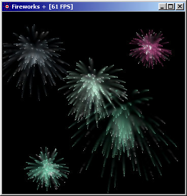



## Fireworks \+   \(Updated on 18/06/03\)

### Description

This is my own version of the fireworks project posted on 30th May in the C++ section. Courious thing is that it was already a port from Java, so this is "The VB port of the C++ ported version".

My intention in this project was to fix the bugs that were around, as the author knew nothing about how to fix them. My main problem is i don't feel quite well with C++, so i needed first to put it in my native programming language.

I fixed the problem where the fireworks could explode at the top of the screen, leaving trails for unlimited frames, and also fixed the banding problem that caused the smoke trails to fall through the borders. In the meantime, i wanted to add a few goodies to the original code, so i added resizing ability, better fading code, and commented every line of code to make it a very easy to follow example.

My devoted thanks to the original author, Andrew Heinlein (Mouse), for his great work (CODE ID=6331). As i coudn't contact him by e-mail, i guess it is right to post here my work (more if it is just a rewrite of the rewritten code).

HAVE FUN, AND HOPE YOU LIKE IT!!!

UPDATE: I added a FPS limiter so as not to get the crazy 200+ frames... i also (hopefully) fixed the crashing on WinNT... i just forgot that i should unmap the arrays ;)

NEW UPDATE: The DoEvents in the frame rate limiter was causing problems quitting the app so i removed it. I was also mapping the arrays prematurely, so that caused some random crashes on resizing.
 
### More Info
 

             |
---                |---
**Submitted On**   |2003-06-16 23:27:00
**By**             |[gonchuki\_](https://github.com/Planet-Source-Code/PSCIndex/blob/master/ByAuthor/gonchuki.md)
**Level**          |Intermediate
**User Rating**    |5.0 (125 globes from 25 users)
**Compatibility**  |VB 4\.0 \(32\-bit\), VB 5\.0, VB 6\.0
**Category**       |[Graphics](https://github.com/Planet-Source-Code/PSCIndex/blob/master/ByCategory/graphics__1-46.md)
**World**          |[Visual Basic](https://github.com/Planet-Source-Code/PSCIndex/blob/master/ByWorld/visual-basic.md)
**Archive File**   |[Fireworks\_1602376172003\.zip](https://github.com/Planet-Source-Code/gonchuki-fireworks-updated-on-18-06-03__1-46182/archive/master.zip)

